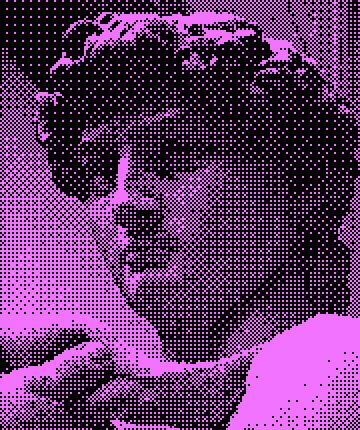

# didder

[](https://goreportcard.com/report/github.com/makeworld-the-better-one/didder)

<p align="center">

</p>


didder is an extensive, fast, and accurate command-line image dithering tool. It is designed to work well for both power users as well as pipeline scripting.
It is backed by my [dithering library](https://github.com/makeworld-the-better-one/dither), and is unique in its correctness and variety of dithering algorithms. No online or offline tool I know of provides as many options, while being correct (linearizing the image).

It does not support images that make use of the alpha channel (transparency), but it will in the future.

## Types of dithering supported

- Random noise (in grayscale and RGB)
- **Ordered Dithering**
  - Bayer matrix of any size (as long as dimensions are powers of two)
  - Clustered-dot - many different preprogrammed matrices
  - Some unusual horizontal or vertical line matrices
  - Yours? You can provide your own ordered dithering matrix in JSON format
- **Error diffusion dithering**
  - Simple 2D
  - Floyd-Steinberg, False Floyd-Steinberg
  - Jarvis-Judice-Ninke
  - Atkinson
  - Stucki
  - Burkes
  - Sierra/Sierra3, Sierra2, Sierra2-4A/Sierra-Lite
  - [Steven Pigeon](https://hbfs.wordpress.com/2013/12/31/dithering/)
  - Yours? You can provide your own error diffusion matrix in JSON format

More methods of dithering are being worked on, such as Riemersma, Yuliluoma, and blue noise. If you'd like to help out with development of those methods, or request a new one, please make an issue in my [dither](https://github.com/makeworld-the-better-one/dither) library repo, not this one.

## Features
- Set palette using RGB tuples, hex codes, number 0-255 (grayscale), or [SVG color names](https://www.w3.org/TR/SVG11/types.html#ColorKeywords)
  - All colors are interpreted in the sRGB colorspace
- Optionally recolor image with a different palette after dithering
- Set dithering strength
- Image is automatically converted to grayscale if palette is grayscale
- Force image to grayscale with `--grayscale`
- Change image saturation, brightness, or contrast before dithering
- Read EXIF rotation tags by default (disabled with `--no-exif-rotation`)
- Downscale image before dithering, keeping aspect ratio
- Upscale image after dithering, without producing artifacts
- Supports input image of types JPEG, GIF (static), PNG, BMP, TIFF 
- Output to PNG or GIF
- Process multiple images with one command
- Combine multiple images into an animated GIF
- Uses all CPU cores when possible

## Installation

### Binary

Download a binary from the [releases](https://github.com/makeworld-the-better-one/didder/releases) page. On Unix-based systems you will have to make the file executable with `chmod +x <filename>`. You can rename the file to just `didder` for easy access, and move it to `/usr/local/bin/`.

On Windows you will have to open a terminal or cmd window in the same directory as the EXE file, or [add it to your PATH](https://stackoverflow.com/a/41895179).

Make sure to click "Watch" in the top right, then "Custom" > "Releases" to get notified about new releases!

### From source

**Requirements**
- Go 1.14 or later
- GNU Make

Please note the Makefile does not intend to support Windows, and so there may be issues.

```shell
git clone https://github.com/makeworld-the-better-one/didder
cd didder
# git checkout v1.2.3 # Optionally pin to a specific version instead of the latest commit
make # Might be gmake on macOS
sudo make install # If you want to install the binary for all users
```

## Getting started

```
didder [global options] command [command options] [arguments...]
```

Run `didder` to see some info, and the global options and commands. Run `didder help cmd` or `didder cmd --help` to see information and opions for a specific command.
Each command represents a different dithering algorithm, or set of algorithms.

Here's a fully working command as an example:
```shell
didder --palette 'black white' -i input.jpg -o test.png bayer 16x16
```
This command dithers `input.jpg` to just use black and white (implicitly converting to grayscale first), using a 16x16 Bayer matrix. The result is written to `test.png`.

As another example, here's the command used for the image at the top of the README:
```shell
didder -i david.png -o david_dithered.png --palette 'black white' --recolor 'black F273FF' --upscale 2 bayer 4x4
```

If you'd like the replicate this yourself, the input image is available [here](https://upload.wikimedia.org/wikipedia/commons/7/71/Michelangelo%27s_David_-_63_grijswaarden.png).

## What method should I use?

Generally, using Floyd-Steinberg serpentine dithering will produce results with the fewest artifacts. The command would be:

```shell
didder [palette and I/O options] edm --serpentine FloydSteinberg
```

Playing with the strength of the matrix might also be useful. The example above is at full strength, but sometimes that's too noisy. The command for 80% strength looks like this:

```shell
didder --strength 80% [palette and I/O options] edm --serpentine FloydSteinberg
```

The main reason for using any other dithering algorithm would be

- **Aesthetics** - dithering can be a cool image effect, and different methods will produce different and stronger artifacts
- **Speed** - error diffusion dithering is sequential and therefore single-threaded. But ordered dithering, like using `Bayer`, will use all available CPUs, which is much faster.

If you want to see examples of the different dithering algorithms, you can look at [this directory](https://github.com/makeworld-the-better-one/dither/tree/master/images/output). Or try them out yourself!

## Avoid these mistakes

- It's easy to mess up a dithered image by scaling it manually. It's best to scale the image to the size you want before dithering (externally, or with `--width` and/or `--height`), and then leave it
- If you need to scale it up afterward, use `--upscale`, rather than another tool. This will prevent image artifacts or blurring.
- Be wary of environments where you can't make sure an image will be displayed at 100% size, pixel for pixel. Make sure nearest-neighbor scaling is being used at least.
- Dithered images must only be encoded in a lossless image format. This is why the tool only outputs PNG or GIF.

See [here](https://github.com/makeworld-the-better-one/dither#scaling-images) for more information on these points.

## When to use `--recolor`

The `--recolor` flag exists because when palettes that are severely limited in terms of RGB spread are used, accurately representing the image colors with the desired palette is impossible. Instead of accuracy of color, the new goal is accuracy of luminance, or even just accuracy of contrast. For example, the original Nintendo Game Boy used a solely [green palette](https://en.wikipedia.org/wiki/List_of_video_game_console_palettes#Game_Boy). By setting `--palette` to shades of gray and then `--recolor`ing to the desired shades of green, input images will be converted to grayscale automatically and then dithered in one dimension (gray), rather than trying to dither a color image (three dimensions, RGB) into a one dimensional green palette. This is similar to "hue shifting" or "colorizing" an image in image editing software.

For these situations, `--recolor` should usually be a palette made up of one hue, and `--palette` should be the grayscale version of that palette. The `--palette` could also be just equally spread grayscale values, which would increase the contrast but make the luminance inaccurate.

Recoloring can also be useful for increasing contrast on a strange palette, like: `--palette 'black white' --recolor 'indigo LimeGreen'`. Setting just `--palette 'indigo LimeGreen'` would give bad (low contrast) results because that palette is not that far apart in RGB space. These "bad results" are much more pronounced when the input image is in color, because three dimensions are being reduced.

Another usage of `--recolor` would be to invert the image colors, by providing `--palette` in reverse. But this is the same as providing the inverted image beforehand.

If you have found other uses for `--recolor`, let me know!

## Other info

To increase the dithering artifacts for aesthetic effect, you can downscale the image before dithering and upscale after. Like if the image is 1000 pixels tall, your command can look like `didder --height 500 --upscale 2 [...]`. Depending on the input image size and what final size you want, you can of course just upscale as well.


## License
This project is licensed under the GPL v3.0. See the [LICENSE](./LICENSE) file for details.
